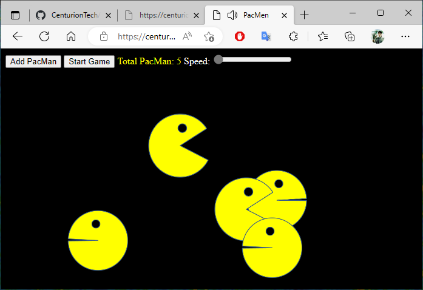

### Title of the project: PacMen
Description of the project: In this exercise we create and move pacman figures across the screen, each time that pacman reach the borders on the screen (left or right) it change the direction of movement.  
How to Run: Select the link in Centurion Tech's Portfolio > Projects  
Roadmap of future improvements: I added sound effects and how fast the pacman moves 

## PacMen Repository
<a href="https://github.com/CenturionTech/pacmen">PacMen Exercise </a>
